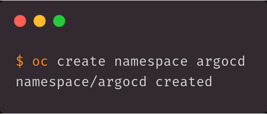
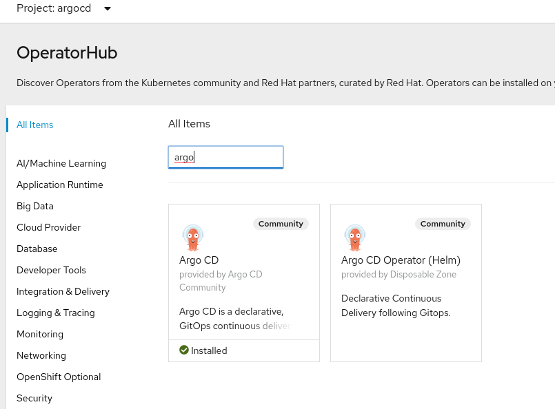
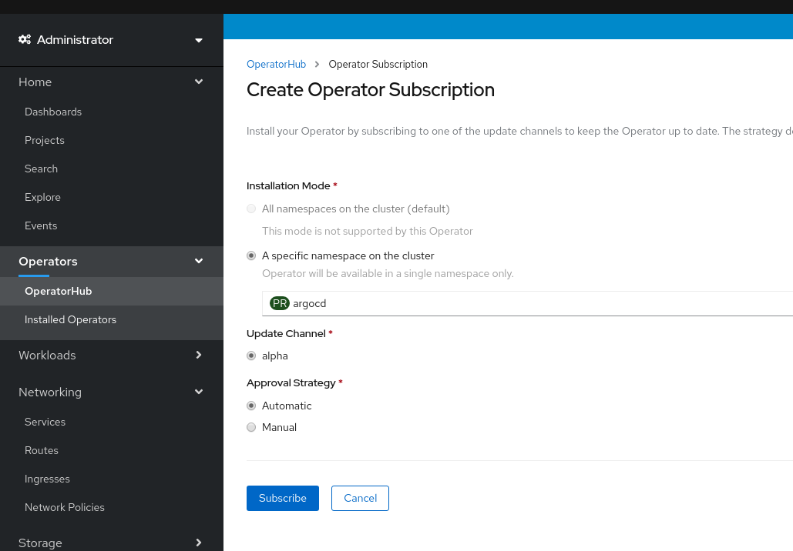
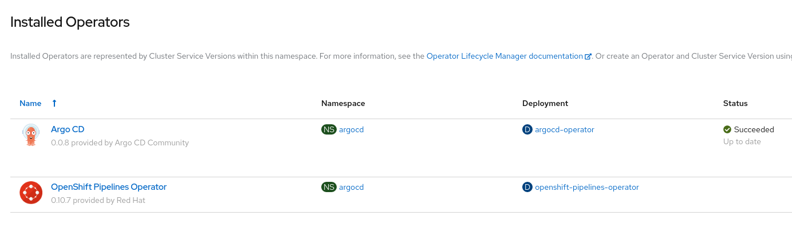
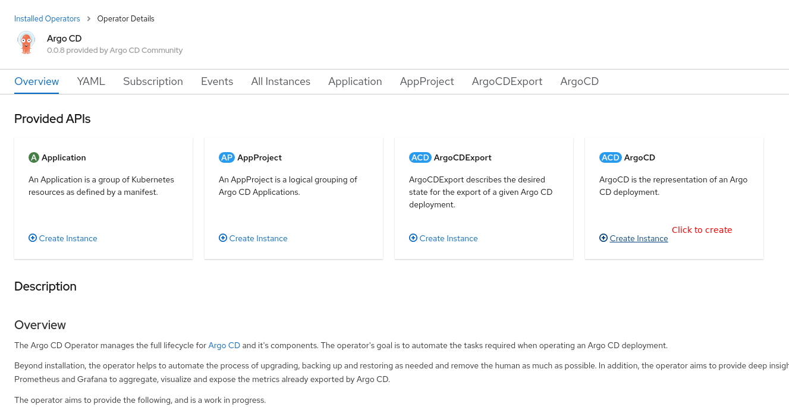
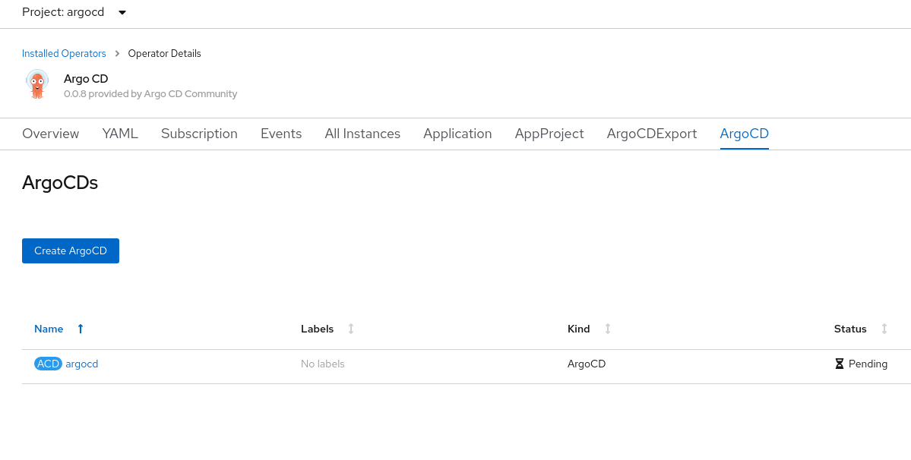
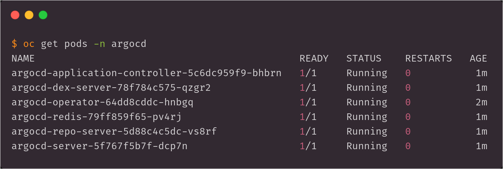
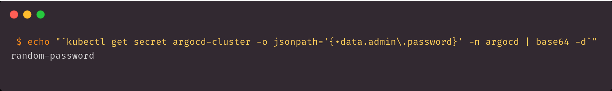
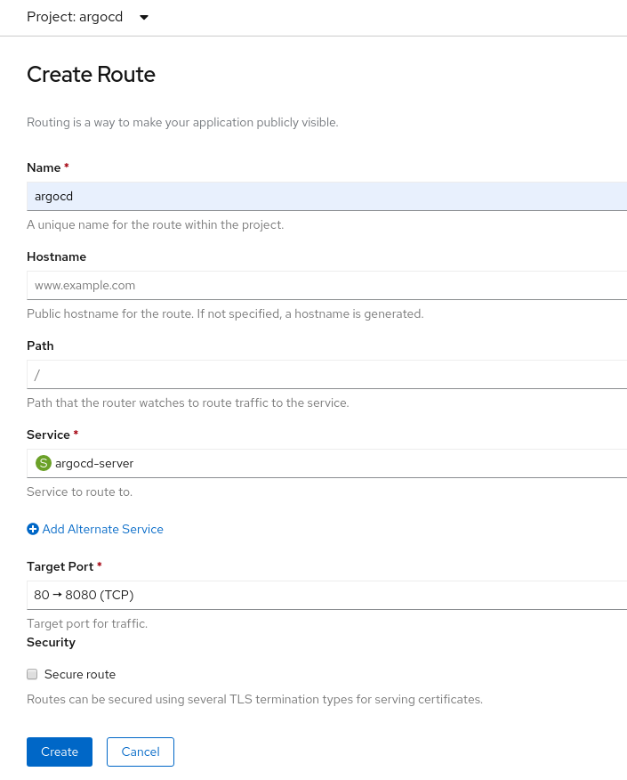
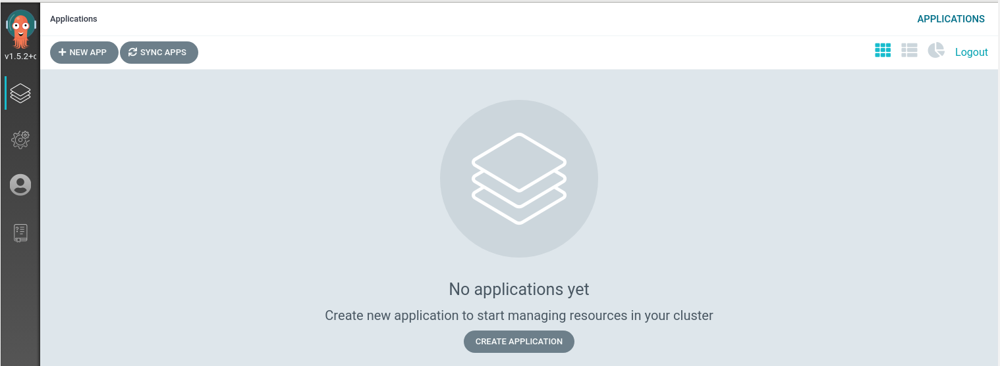

# Installation of ArgoCD through the Operator Hub

## Table of contents

1. [Create argocd namespace](#step-1)
2. [Installing the ArgoCD operator](#step-2)
3. [Create ArgoCD installation](#step-3)
4. [Wait for the ArgoCD pods](#step-4)
5. [Get your ArgoCD password](#step-5)
6. [Expose your ArgoCD installation](#step-6)
7. [Login to ArgoCD](#step-7)

## Step 1

You will need to create the `argocd` namespace, you can easily do this with `oc create namespace argocd`.



## Step 2

Find the ArgoCD Operator in the Operator Hub.



Create a subscription to the operator, this _must_ be in the `argocd` namespace.



You should now see the installed operators



## Step 3

Create an ArgoCD installation

You'll need to setup ArgoCD within the operator, to do this, requires creating
an ArgoCD resource.



This should indicate that you have a deployed ArgoCD operator.



## Step 4

Check that the pods have come up

ArgoCD may take some time to fully come up, it has a number of pods that need
to startup.



## Step 5

Retrieve the ArgoCD password for the UI

```shell
$ echo "`oc get secret argocd-cluster -o jsonpath='{.data.admin\.password}' -n argocd | base64 -d`"
random-password-chars
```



## Step 6

Add a route to expose the `argocd-server` service.



If you're working locally with crc, you'll may need to use port-forwarding.

```shell
$ oc port-forward -n argocd svc/argocd-server 8080:80`
```
## Step 7

You can login to your new empty ArgoCD installation by visiting the route.


And finally, you'll get to see the new empty ArgoCD environment.


